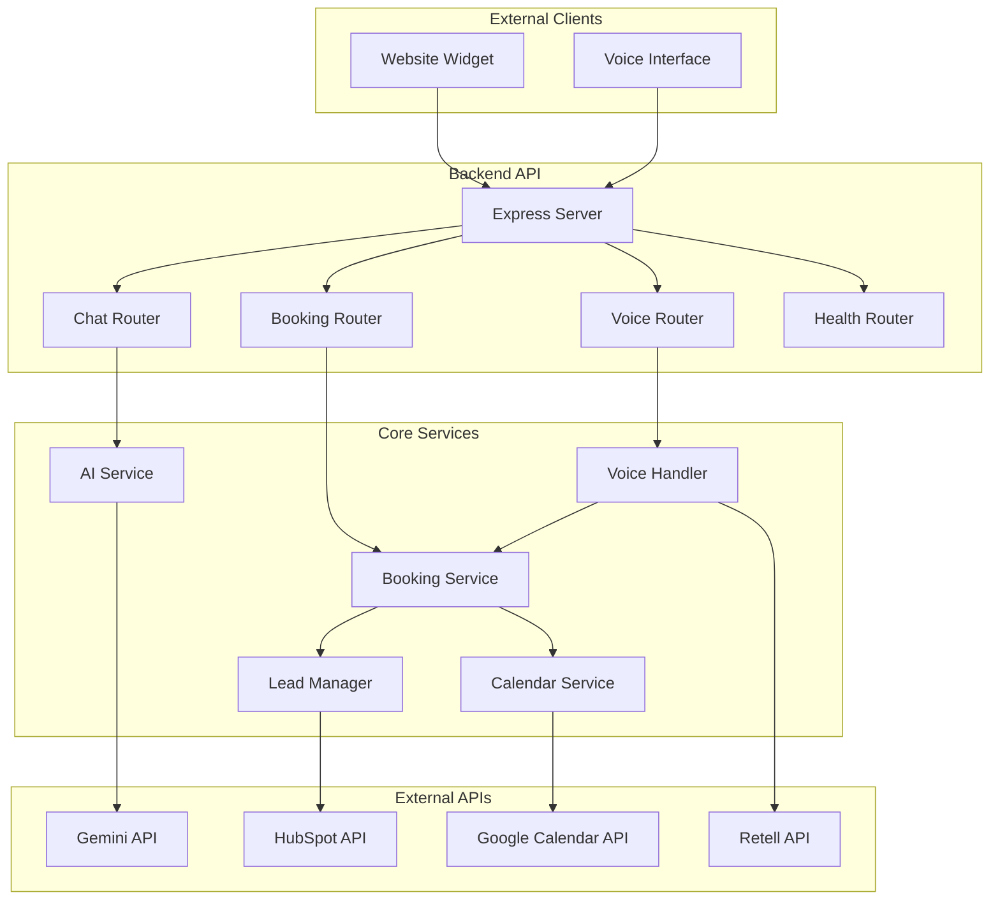

# Design Document: AI-Powered Chat and Voice Booking Assistant

## Overview

The AI-powered Chat and Voice Booking Assistant is a comprehensive Node.js application that provides conversational AI capabilities for Metalogics.io. The system integrates multiple third-party services to deliver a seamless booking experience through both chat and voice interfaces, while managing leads and calendar events automatically.

The architecture follows a modular design with clear separation of concerns, enabling maintainable and scalable code. The system uses modern Node.js patterns with Express.js for the web server, official SDKs for third-party integrations, and environment-based configuration for security.

## Architecture



## Components and Interfaces

### 1. Express Server (app.js)

The main application server that handles HTTP requests, middleware setup, and routing.

**Key Features:**

- CORS configuration for widget embedding
- Request validation middleware
- Error handling middleware
- Rate limiting for security
- Health check endpoints

**Environment Variables:**

- `PORT`: Server port (default: 3000)
- `NODE_ENV`: Environment mode
- `CORS_ORIGINS`: Allowed origins for CORS

### 2. AI Service (services/aiService.js)

Handles all Gemini API interactions for conversational AI.

**Key Methods:**

```javascript
class AIService {
  async generateResponse(message, context = [])
  async isBookingIntent(message)
  async extractBookingInfo(message, currentInfo = {})
}
```

**Features:**

- Context-aware conversations using chat history
- Company-scoped responses with system prompts
- Booking intent detection
- Information extraction from natural language

**Integration:**

- Uses `@google/generative-ai` SDK
- Implements conversation memory management
- Handles API rate limits and errors gracefully

### 3. Booking Service (services/bookingService.js)

Orchestrates the complete booking flow including validation, calendar creation, and lead management.

**Key Methods:**

```javascript
class BookingService {
  async processBooking(bookingData)
  async validateTimeSlot(dateTime, duration)
  async getAvailableSlots(date)
  async confirmBooking(bookingId)
}
```

**Booking Flow:**

1. Validate required fields (name, email, company, inquiry, time, duration)
2. Check time slot availability
3. Create calendar event
4. Create/update HubSpot contact
5. Send confirmation response

### 4. Calendar Service (services/calendarService.js)

Manages Google Calendar integration using service account authentication.

**Key Methods:**

```javascript
class CalendarService {
  async createEvent(eventData)
  async checkAvailability(startTime, endTime)
  async listAvailableSlots(date, duration)
}
```

**Features:**

- Service account authentication
- Event creation with attendee details
- Availability checking
- Time zone handling
- Error recovery for API failures

**Configuration:**

- Uses Google Service Account JSON credentials
- Requires calendar sharing with service account email
- Supports multiple calendar management

### 5. Lead Manager (services/leadManager.js)

Handles HubSpot CRM integration for lead storage and management.

**Key Methods:**

```javascript
class LeadManager {
  async createOrUpdateContact(contactData)
  async createLead(leadData)
  async checkExistingContact(email)
}
```

**Features:**

- Duplicate contact prevention
- Lead property mapping
- Batch operations support
- API error handling and retry logic

**HubSpot Integration:**

- Uses `@hubspot/api-client` SDK
- Implements contact search before creation
- Maps booking data to HubSpot properties

### 6. Voice Handler (services/voiceHandler.js)

Manages Retell AI integration for voice interactions.

**Key Methods:**

```javascript
class VoiceHandler {
  async handleWebhook(webhookData)
  async processVoiceBooking(voiceData)
  async generateVoiceResponse(message, context)
}
```

**Features:**

- Webhook signature verification
- Voice-to-text processing
- Mirrors chat booking logic
- Voice response generation

## Data Models

### Booking Data Structure

```javascript
const BookingSchema = {
  id: String,
  name: String, // Required
  email: String, // Required, validated
  company: String, // Required
  inquiry: String, // Required
  dateTime: Date, // Required, ISO format
  duration: Number, // Required: 15, 30, 45, or 60 minutes
  status: String, // 'pending', 'confirmed', 'cancelled'
  calendarEventId: String,
  hubspotContactId: String,
  createdAt: Date,
  updatedAt: Date,
};
```

### Conversation Context

```javascript
const ConversationContext = {
  sessionId: String,
  messages: [
    {
      role: String, // 'user' or 'assistant'
      content: String,
      timestamp: Date,
    },
  ],
  bookingInProgress: Boolean,
  partialBookingData: Object,
  lastActivity: Date,
};
```

### Calendar Event Structure

```javascript
const CalendarEvent = {
  summary: String, // Meeting title
  description: String, // User details and inquiry
  start: {
    dateTime: String, // ISO format
    timeZone: String,
  },
  end: {
    dateTime: String, // ISO format
    timeZone: String,
  },
  attendees: [
    {
      email: String,
      displayName: String,
    },
  ],
};
```

### HubSpot Contact Properties

```javascript
const HubSpotContact = {
  email: String,
  firstname: String,
  lastname: String,
  company: String,
  phone: String,
  inquiry_details: String,
  booking_date: String,
  meeting_duration: String,
  lead_source: String, // 'chat' or 'voice'
};
```

## Correctness Properties

_A property is a characteristic or behavior that should hold true across all valid executions of a system—essentially, a formal statement about what the system should do. Properties serve as the bridge between human-readable specifications and machine-verifiable correctness guarantees._

### Property 1: AI Response Generation and Scoping

_For any_ user message sent to the chat endpoint, the AI_Assistant should generate responses using the Gemini API while restricting answers to Metalogics.io-related knowledge and maintaining strict context boundaries to prevent hallucinations.
**Validates: Requirements 1.1, 1.2, 1.5**

### Property 2: Input Validation and Security

_For any_ user input received by the Backend_API, the system should validate and sanitize all inputs to prevent injection attacks, and never expose API keys or secrets in responses or logs.
**Validates: Requirements 1.4, 7.4, 9.1, 9.5**

### Property 3: Complete Booking Data Collection

_For any_ booking initiation, the Booking_System should collect all required fields (name, email, company, inquiry, preferred time slot, and meeting duration) through conversational guidance before proceeding.
**Validates: Requirements 2.1, 2.2**

### Property 4: Time Slot Validation and Duration Constraints

_For any_ provided time slot and duration, the Booking_System should validate availability and only accept meeting durations of 15, 30, 45, and 60 minutes.
**Validates: Requirements 2.3, 2.5**

### Property 5: Booking Creation Completeness

_For any_ complete set of booking information, the Booking_System should create a booking record that triggers both calendar event creation and HubSpot lead management.
**Validates: Requirements 2.4, 3.1, 4.1**

### Property 6: Calendar Event Accuracy

_For any_ confirmed booking, the Calendar_Service should create events with correct start time, duration, and user information in the description using Google Service Account authentication.
**Validates: Requirements 3.2, 3.3, 3.4**

### Property 7: HubSpot Contact Management

_For any_ booking completion, the Lead_Manager should create or update HubSpot contacts while preventing duplicates and including all booking details as lead properties.
**Validates: Requirements 4.2, 4.3**

### Property 8: Voice-Chat Functional Parity

_For any_ booking functionality available in chat, the Voice_Handler should provide equivalent functionality through voice interactions, including HubSpot and calendar integrations.
**Validates: Requirements 5.1, 5.2, 5.3, 5.4, 5.5**

### Property 9: Widget Security and Communication

_For any_ embedded widget interaction, the system should use secure API calls with proper authentication and handle CORS requests appropriately.
**Validates: Requirements 6.3, 6.4**

### Property 10: Environment-Based Configuration

_For any_ sensitive configuration or API key, the Backend_API should load values from environment variables without hard-coding secrets in the source code.
**Validates: Requirements 7.5, 8.2**

### Property 11: Rate Limiting and Security Controls

_For any_ series of API requests, the Backend_API should implement rate limiting to prevent abuse and use HTTPS for all external communications.
**Validates: Requirements 9.2, 9.4**

### Property 12: Comprehensive Logging

_For any_ key system operation, the Backend_API should generate appropriate logs for monitoring and debugging without exposing sensitive information.
**Validates: Requirements 8.3**

## Error Handling

### Graceful Degradation Strategy

The system implements a multi-layered error handling approach that ensures core functionality remains available even when individual integrations fail:

1. **AI Service Failures**: If Gemini API is unavailable, return predefined fallback responses
2. **Calendar Integration Failures**: Log errors but continue with booking confirmation
3. **HubSpot Integration Failures**: Log errors but continue with booking flow
4. **Voice Service Failures**: Fallback to chat-only mode with user notification

### Error Response Format

```javascript
const ErrorResponse = {
  success: false,
  error: {
    code: String, // Error code for client handling
    message: String, // User-friendly error message
    details: String, // Technical details (development only)
    timestamp: Date,
  },
};
```

### Retry Logic

- **HubSpot API**: Exponential backoff with 3 retry attempts
- **Google Calendar API**: Exponential backoff with 3 retry attempts
- **Gemini API**: Single retry with fallback to cached responses
- **Retell API**: No retries (real-time voice constraints)

### Circuit Breaker Pattern

Implement circuit breakers for external API calls to prevent cascade failures:

- **Open**: After 5 consecutive failures
- **Half-Open**: After 30-second cooldown
- **Closed**: After successful request in half-open state

## Testing Strategy

### Dual Testing Approach

The system requires both unit testing and property-based testing to ensure comprehensive coverage:

**Unit Tests**: Verify specific examples, edge cases, and error conditions

- API endpoint responses
- Error handling scenarios
- Integration points between components
- Specific booking flow examples

**Property Tests**: Verify universal properties across all inputs

- Input validation across all endpoints
- Booking flow completeness
- Integration consistency
- Security property enforcement

### Property-Based Testing Configuration

- **Testing Library**: Use `fast-check` for JavaScript property-based testing
- **Test Iterations**: Minimum 100 iterations per property test
- **Test Tagging**: Each property test must reference its design document property
- **Tag Format**: `**Feature: ai-booking-assistant, Property {number}: {property_text}**`

### Testing Framework Setup

```javascript
// Example property test structure
const fc = require("fast-check");

describe("AI Booking Assistant Properties", () => {
  it("Property 1: AI Response Generation and Scoping", () => {
    // **Feature: ai-booking-assistant, Property 1: AI Response Generation and Scoping**
    fc.assert(
      fc.property(
        fc.string(), // user message
        async (message) => {
          const response = await aiService.generateResponse(message);
          return (
            response.includes("Metalogics") || response.includes("fallback")
          );
        }
      ),
      { numRuns: 100 }
    );
  });
});
```

### Integration Testing

- **End-to-End Booking Flow**: Complete booking via chat and voice
- **Third-Party API Integration**: Mock external services for consistent testing
- **Widget Embedding**: Test widget functionality across different domains
- **Error Scenario Testing**: Simulate API failures and network issues

### Security Testing

- **Input Sanitization**: Test with malicious payloads
- **Rate Limiting**: Verify rate limit enforcement
- **Authentication**: Test API key validation
- **CORS**: Verify cross-origin request handling
