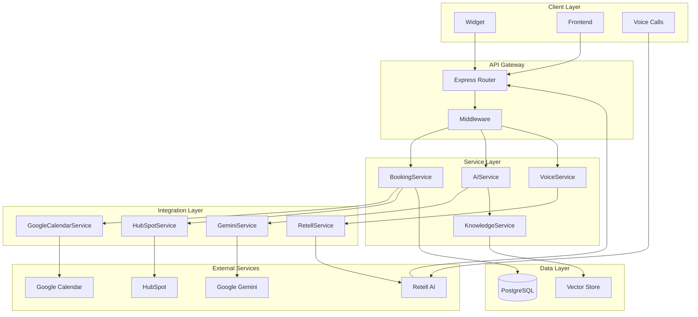

# Design Document: AI Booking Voice Assistant

## Overview

The AI Booking Voice Assistant is a production-ready system that enables customers to book appointments through multiple channels: web chat, voice calls, and embedded widgets. The system integrates with Google Calendar for scheduling, HubSpot for CRM, and uses Google Gemini AI with RAG capabilities for intelligent responses.

The architecture follows Clean Architecture principles with a TypeScript monorepo structure, ensuring maintainability, testability, and scalability. The system is designed for deployment on Railway with separate services for backend API, frontend application, and embeddable widget.

## Architecture

### High-Level Architecture



### Monorepo Structure

```
/
├── apps/
│   ├── backend/
│   │   ├── src/
│   │   │   ├── config/
│   │   │   ├── controllers/
│   │   │   ├── services/
│   │   │   ├── repositories/
│   │   │   ├── integrations/
│   │   │   ├── routes/
│   │   │   ├── middlewares/
│   │   │   └── server.ts
│   │   ├── prisma/
│   │   └── package.json
│   ├── frontend/
│   │   ├── src/
│   │   └── package.json
│   └── widget/
│       ├── src/
│       └── package.json
├── packages/
│   └── shared/
│       ├── types/
│       ├── schemas/
│       └── index.ts
├── prisma/
│   ├── schema.prisma
│   └── migrations/
└── package.json
```

## Components and Interfaces

### Core Services

#### BookingService

**Responsibility**: Core business logic for appointment management

**Key Methods**:

- `createBooking(data: CreateBookingRequest): Promise<Booking>`
- `checkAvailability(startTime: Date, duration: number): Promise<boolean>`
- `updateBookingStatus(id: string, status: BookingStatus): Promise<Booking>`
- `cancelBooking(id: string): Promise<void>`

**Dependencies**: BookingRepository, GoogleCalendarService, HubSpotService

#### AIService

**Responsibility**: Intelligent chat responses and function calling

**Key Methods**:

- `processMessage(message: string, context?: ConversationContext): Promise<AIResponse>`
- `executeFunction(functionCall: FunctionCall): Promise<FunctionResult>`

**Dependencies**: GeminiService, KnowledgeService, BookingService

#### VoiceService

**Responsibility**: Voice interaction processing via Retell AI

**Key Methods**:

- `handleWebhook(payload: RetellWebhookPayload): Promise<WebhookResponse>`
- `processVoiceFunction(functionCall: VoiceFunctionCall): Promise<VoiceFunctionResult>`

**Dependencies**: RetellService, BookingService

#### KnowledgeService

**Responsibility**: RAG-based document retrieval and context injection

**Key Methods**:

- `searchDocuments(query: string): Promise<DocumentChunk[]>`
- `embedDocument(content: string): Promise<number[]>`
- `getRelevantContext(query: string): Promise<string>`

### Integration Services

#### GoogleCalendarService

**Responsibility**: Google Calendar API integration with rate limiting

**Key Methods**:

- `createEvent(booking: Booking): Promise<string>`
- `updateEvent(eventId: string, booking: Booking): Promise<void>`
- `deleteEvent(eventId: string): Promise<void>`

**Rate Limiting**: Uses Bottleneck with exponential backoff (max 5 requests/second per user)

#### HubSpotService

**Responsibility**: CRM contact management

**Key Methods**:

- `createOrUpdateContact(contactData: ContactData): Promise<string>`
- `addBookingToContact(contactId: string, booking: Booking): Promise<void>`

#### RetellService

**Responsibility**: Retell AI webhook processing and security

**Key Methods**:

- `verifyWebhook(signature: string, payload: string): boolean`
- `parseVoiceFunction(transcript: string): VoiceFunctionCall | null`

#### GeminiService

**Responsibility**: Google Gemini AI integration with function calling

**Key Methods**:

- `generateResponse(prompt: string, functions: FunctionDeclaration[]): Promise<GeminiResponse>`
- `executeFunction(functionCall: FunctionCall): Promise<any>`

**Function Declarations**:

- `book_appointment`: Creates new bookings
- `check_availability`: Checks time slot availability
- `get_company_info`: Retrieves RAG-based company information

## Data Models

### Database Schema (Prisma)

```prisma
model Booking {
  id                 String        @id @default(uuid())
  name               String
  email              String
  phone              String?
  inquiry            String?
  startTime          DateTime
  duration           Int           // minutes
  status             BookingStatus @default(PENDING)
  confirmationSent   Boolean       @default(false)
  reminderSent       Boolean       @default(false)
  calendarEventId    String?
  crmContactId       String?
  createdAt          DateTime      @default(now())
  updatedAt          DateTime      @updatedAt

  @@index([startTime])
  @@index([email])
  @@map("bookings")
}

enum BookingStatus {
  PENDING
  CONFIRMED
  CANCELLED
  NO_SHOW
  COMPLETED
}

model Document {
  id        String   @id @default(uuid())
  title     String
  content   String
  embedding Float[]  // Vector embedding
  metadata  Json?
  createdAt DateTime @default(now())
  updatedAt DateTime @updatedAt

  @@map("documents")
}
```

### TypeScript Interfaces

```typescript
// Shared types in packages/shared/types
export interface CreateBookingRequest {
  name: string;
  email: string;
  phone?: string;
  inquiry?: string;
  startTime: Date;
  duration: number;
}

export interface BookingResponse {
  id: string;
  name: string;
  email: string;
  phone?: string;
  inquiry?: string;
  startTime: Date;
  duration: number;
  status: BookingStatus;
  calendarEventId?: string;
  crmContactId?: string;
}

export interface AIResponse {
  message: string;
  functionCalls?: FunctionCall[];
  context?: ConversationContext;
}

export interface FunctionCall {
  name: string;
  arguments: Record<string, any>;
}

export interface RetellWebhookPayload {
  event: string;
  call: {
    call_id: string;
    agent_id: string;
    transcript: string;
    call_status: string;
    // ... other Retell fields
  };
}
```

## Error Handling

### Centralized Error Middleware

```typescript
export class AppError extends Error {
  constructor(
    public statusCode: number,
    public code: string,
    message: string,
    public isOperational = true
  ) {
    super(message);
  }
}

export const errorHandler = (
  error: Error,
  req: Request,
  res: Response,
  next: NextFunction
) => {
  if (error instanceof AppError) {
    return res.status(error.statusCode).json({
      error: {
        code: error.code,
        message: error.message,
      },
    });
  }

  // Log unexpected errors
  logger.error("Unexpected error:", error);

  return res.status(500).json({
    error: {
      code: "INTERNAL_SERVER_ERROR",
      message: "An unexpected error occurred",
    },
  });
};
```

### Error Codes

- `BOOKING_CONFLICT`: Time slot already booked
- `INVALID_TIME_SLOT`: Requested time is in the past or outside business hours
- `CALENDAR_SYNC_FAILED`: Google Calendar integration error
- `CRM_SYNC_FAILED`: HubSpot integration error (non-blocking)
- `VOICE_WEBHOOK_INVALID`: Retell webhook signature verification failed
- `AI_SERVICE_ERROR`: Gemini API error
- `RATE_LIMIT_EXCEEDED`: Too many requests

### Graceful Degradation

- **Calendar Sync Failure**: Booking still created, manual calendar entry required
- **CRM Sync Failure**: Booking created, CRM sync retried in background
- **AI Service Failure**: Fallback to predefined responses
- **Voice Service Failure**: Graceful error message to caller

## Testing Strategy

### Dual Testing Approach

The system will use both unit tests and property-based tests to ensure comprehensive coverage:

**Unit Tests**:

- Specific examples and edge cases
- Integration points between services
- Error condition handling
- Mock external service calls for isolated testing

**Property-Based Tests**:

- Universal properties that hold across all inputs
- Minimum 100 iterations per property test
- Each test tagged with: **Feature: ai-booking-voice-assistant, Property {number}: {property_text}**

### Testing Framework Configuration

- **Unit Testing**: Jest with TypeScript support
- **Property-Based Testing**: fast-check library
- **Integration Testing**: Supertest for API endpoints
- **Database Testing**: In-memory SQLite for fast test execution

### Test Organization

```
/apps/backend/src/
├── services/
│   ├── BookingService.ts
│   ├── BookingService.test.ts
│   └── BookingService.property.test.ts
├── integrations/
│   ├── GoogleCalendarService.ts
│   └── GoogleCalendarService.test.ts
└── controllers/
    ├── BookingController.ts
    └── BookingController.test.ts
```

## Correctness Properties

_A property is a characteristic or behavior that should hold true across all valid executions of a system-essentially, a formal statement about what the system should do. Properties serve as the bridge between human-readable specifications and machine-verifiable correctness guarantees._

### Property 1: Booking Creation Completeness

_For any_ valid booking request with required fields (name, email, startTime, duration), the system should create a booking record with a unique ID, PENDING status, and all provided fields stored correctly.
**Validates: Requirements 1.1, 1.4, 8.2**

### Property 2: Double Booking Prevention

_For any_ two booking requests with overlapping time slots, the second booking should be rejected with a conflict error.
**Validates: Requirements 1.2, 1.3**

### Property 3: Valid Duration Enforcement

_For any_ booking request, the duration should be accepted only if it matches one of the allowed values (15, 30, 45, 60, 90, 120 minutes), otherwise it should be rejected.
**Validates: Requirements 1.5**

### Property 4: Calendar Event Synchronization

_For any_ booking status change (confirmed, cancelled, updated), the corresponding calendar event should be created, deleted, or updated accordingly, and the calendar event ID should be stored in the booking record.
**Validates: Requirements 2.1, 2.2, 2.3, 2.4**

### Property 5: CRM Contact Integration

_For any_ booking creation, a HubSpot contact should be created or updated with customer details and booking metadata, and the CRM contact ID should be stored in the booking record.
**Validates: Requirements 3.1, 3.2, 3.3, 3.5**

### Property 6: CRM Failure Graceful Degradation

_For any_ booking creation where CRM integration fails, the booking should still be created successfully and the error should be logged.
**Validates: Requirements 3.4**

### Property 7: Voice Webhook Processing

_For any_ valid Retell AI webhook payload, the voice service should process it and extract any booking-related function calls correctly.
**Validates: Requirements 4.1, 4.2**

### Property 8: Voice Booking Integration

_For any_ voice-initiated booking request, the voice service should delegate to the booking service and provide spoken confirmation of the result.
**Validates: Requirements 4.3, 4.4**

### Property 9: AI Message Processing

_For any_ chat message, the AI service should process it using Gemini and generate an appropriate response, calling booking functions when booking intent is detected.
**Validates: Requirements 5.1, 5.2, 5.5**

### Property 10: Conversation Context Preservation

_For any_ sequence of messages in a conversation session, the AI service should maintain context across all messages in that session.
**Validates: Requirements 5.4**

### Property 11: RAG Knowledge Integration

_For any_ company-related query, the knowledge service should search relevant documents, inject context into AI prompts when found, and provide helpful fallback responses when no relevant information exists.
**Validates: Requirements 5.3, 6.1, 6.3, 6.5**

### Property 12: Document Similarity Search

_For any_ query, the knowledge service should return documents ranked by relevance, with more recent and similar documents ranked higher.
**Validates: Requirements 6.2, 6.4**

### Property 13: Widget Style Isolation

_For any_ host website, the embedded widget should not interfere with the host's CSS styles and should maintain its own styling through Shadow DOM isolation.
**Validates: Requirements 7.2**

### Property 14: Widget API Type Safety

_For any_ API communication between the widget and backend, the requests and responses should conform to the shared TypeScript type definitions.
**Validates: Requirements 7.5, 10.3**

### Property 15: Booking Status State Machine

_For any_ booking, status transitions should only be allowed according to the valid state machine (PENDING → CONFIRMED → COMPLETED/CANCELLED), and invalid transitions should be rejected.
**Validates: Requirements 8.4**

### Property 16: Database Referential Integrity

_For any_ booking record, all foreign key references to external services (calendar event ID, CRM contact ID) should maintain referential integrity.
**Validates: Requirements 8.3**

### Property 17: Structured Error Responses

_For any_ error condition, the system should return a properly structured JSON response with an error code and message, and log the error appropriately.
**Validates: Requirements 9.2, 9.3, 9.4**

### Property 18: Rate Limiting Protection

_For any_ client making excessive requests, the system should apply rate limiting and return appropriate throttling responses.
**Validates: Requirements 11.4**

### Property 19: Environment Validation Round Trip

_For any_ system startup, all required environment variables should be validated, and the system should fail fast with clear error messages if any are missing.
**Validates: Requirements 9.5, 11.3**

### Property 20: Service Operation Logging

_For any_ service operation (booking creation, calendar sync, CRM update), appropriate log entries should be generated with correct log levels and structured information.
**Validates: Requirements 9.3**

## Testing Strategy

### Dual Testing Approach

The system will implement both unit tests and property-based tests to ensure comprehensive coverage:

**Unit Tests**:

- Test specific examples and edge cases
- Verify integration points between services
- Test error conditions and boundary values
- Mock external service calls for isolated testing
- Focus on concrete scenarios and known edge cases

**Property-Based Tests**:

- Verify universal properties across randomized inputs
- Test system behavior with generated data
- Validate correctness properties defined above
- Run minimum 100 iterations per property test
- Each test tagged with: **Feature: ai-booking-voice-assistant, Property {number}: {property_text}**

### Testing Framework Configuration

**Property-Based Testing**: fast-check library for TypeScript

- Configured for minimum 100 iterations per property
- Custom generators for domain objects (bookings, dates, durations)
- Shrinking enabled for minimal counterexamples

**Unit Testing**: Jest with TypeScript support

- Supertest for API endpoint testing
- In-memory SQLite for fast database tests
- Mock implementations for external services

**Integration Testing**:

- End-to-end API testing with real database
- Widget embedding tests in different environments
- External service integration tests (with test credentials)

### Test Organization and Coverage

**Service Layer Testing**:

- Each service has both unit tests and property tests
- Property tests validate business rules and invariants
- Unit tests cover specific scenarios and error cases

**Integration Layer Testing**:

- Mock external APIs for unit tests
- Property tests validate integration contracts
- Separate integration tests with real external services

**API Layer Testing**:

- Property tests for request/response validation
- Unit tests for specific endpoint behaviors
- Integration tests for complete user workflows

The testing strategy ensures that both concrete examples work correctly (unit tests) and that universal properties hold across all possible inputs (property tests), providing comprehensive validation of system correctness.
